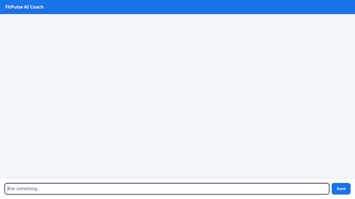

# FitPulse AI Workout Coach 🏋️‍♂️

FitPulse AI is a conversational fitness coach built using Google's **Agent Development Kit (ADK)**. It helps users design personalized workout routines, search exercise libraries, log workout sessions, search public exercise databases, and generate short exercise demonstration videos using Vertex AI Omni models.



---

## ✨ Implemented Capabilities & GCP Services

Based on `app/agent.py` and `agents-cli-manifest.yaml`, the following capabilities and Google Cloud services are fully implemented:

- **Gemini 2.5 Flash Model**: Powers the agent's primary conversational reasoning, exercise recommendations, and tool orchestration.
- **Vertex AI Memory Bank** (`PreloadMemoryTool` & `generate_memories_callback`): Automatically extracts and persists user preferences, fitness goals, target muscle groups, and personal records (PRs) across chat sessions.
- **Google Cloud Firestore Database**:
  - `get_exercise_catalog`: Queries the `exercises` collection in Firestore for target muscle groups and exercise descriptions.
  - `log_workout_session`: Persists completed workout sessions (exercise name, sets, reps, weight in lbs, notes, timestamp) to the `workout_sessions` collection.
  - `get_workout_history`: Retrieves recent logged workout sessions.
- **Agent Engine Sandbox Code Executor**: Runs mathematical strength algorithms (1RM via Epley formula and total volume calculations) safely inside a Python code execution sandbox.
- **Vertex AI Omni Model (`gemini-omni-flash-preview`)**: Generates 3-second exercise demonstration videos on demand in the `global` region (`generate_workout_demonstration_video`).
- **Google Cloud Storage (GCS)**: Automatically uploads generated video bytes to a public GCS bucket (`fitpulse-assets-qwiklabs-gcp-02-82f554a728eb`) and returns public HTTPS URLs.
- **A2UI (Agent-to-User Interface v0.8)**: Generates structured, visual surface cards (`Card`, `Column`, `Row`, `Text`, `Image`) rendered directly in the chat UI via `a2ui_callback`.
- **WGER Public Exercise API**: Retrieves external exercise info and descriptions from the public WGER database.

### 📌 Status of Stretch / Planned Features
- **Custom Progress Charting**: *Planned, not yet implemented.*
- **Cloud Trace Observability**: *Planned, not yet implemented.*

---

## 🛠️ Project Structure

```
fitpulse-agent/
├── app/
│   ├── agent.py            # Main ADK Root Agent, tools, callbacks, and GCP services
│   ├── a2ui_utils.py       # A2UI callback for extracting structured UI cards
│   └── __init__.py
├── frontend/
│   ├── main.py             # FastAPI proxy connecting browser UI to ADK agent over A2A
│   └── static/
│       └── index.html      # Responsive frontend chat UI with built-in A2UI renderer
├── agents-cli-manifest.yaml # Agent Runtime deployment configuration (ACLI 1.1.0)
├── demo.gif                # Optimized looping demonstration GIF
└── pyproject.toml          # Project dependencies and environment specs
```

---

## 🚀 Local Setup & Execution Instructions

Follow these steps to run the FitPulse AI agent and frontend locally on your machine.

### Prerequisites

1. **Python 3.11+** installed.
2. `uv` package manager installed (`pip install uv`).
3. Google Cloud credentials configured with Firestore and Vertex AI access (`gcloud auth application-default login`).

### 1. Install Dependencies

In the project root directory, install all required packages:

```bash
uv sync
```

### 2. Configure Environment Variables

Set your target GCP Project ID and GCS Bucket name:

```bash
export GCP_PROJECT="qwiklabs-gcp-02-82f554a728eb"
export GOOGLE_CLOUD_PROJECT="qwiklabs-gcp-02-82f554a728eb"
```

### 3. Run the ADK Agent Web Playground

To test the agent directly in the ADK Web developer UI:

```bash
uv run adk web
```

### 4. Run the Production FastAPI Frontend Proxy

To run the custom web chat UI with native A2UI card rendering:

```bash
cd frontend
uv run python main.py
```

Open your browser to the local server port output by Uvicorn (e.g. port `8080`).
